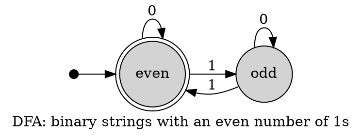
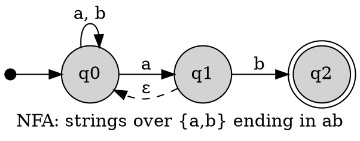

# Graphviz Finite Automata

Use a point node and incoming arrow for the initial state, `doublecircle` for
accepting states, and label every transition with its alphabet symbol or
predicate. Keep semantic IDs distinct from labels.

## Deterministic Finite Automaton

## Nondeterministic Automaton

Nondeterministic transitions can share a symbol; do not merge distinct
destinations. Use `ε` only with controlled fonts and encoding, otherwise an
explained `eps`. A dashed epsilon edge is reinforcement, not sole meaning.
Check self-loops and opposing transitions for separation.

Sources: [Graphviz FSM example](https://graphviz.org/Gallery/directed/fsm.html)
and [node shapes](https://graphviz.org/doc/info/shapes.html).
