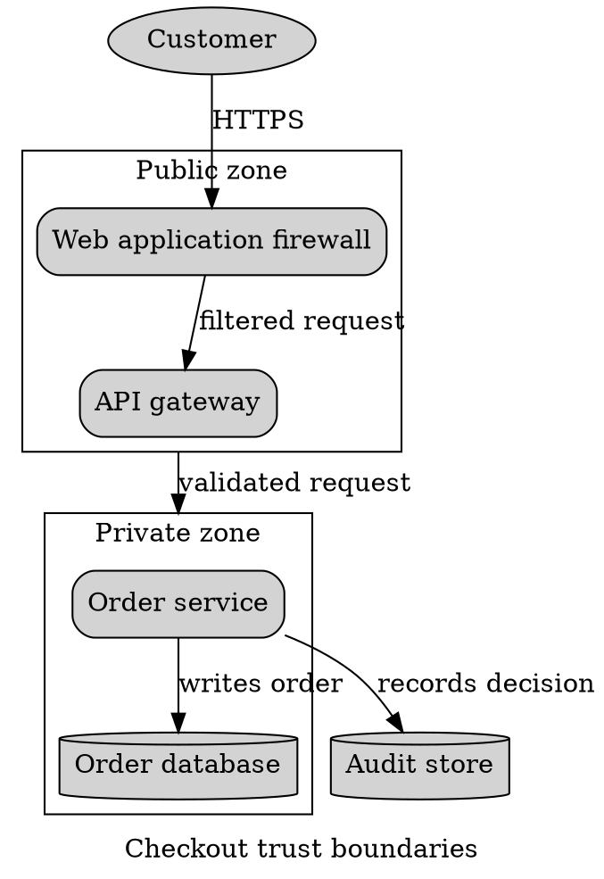

# Graphviz Clusters

Use clusters for meaningful boundaries such as trust zones or deployment units,
not decoration.

Set `compound=true` before `lhead` or `ltail`. Point edges at real nodes; those
attributes only adjust boundary clipping. Label every cluster, keep its border
visible, and nest only when hierarchy matters. Dense cross-cluster edges signal
that the view should split.

Sources: [DOT language](https://graphviz.org/doc/info/lang.html) and
[attributes](https://graphviz.org/doc/info/attrs.html).
