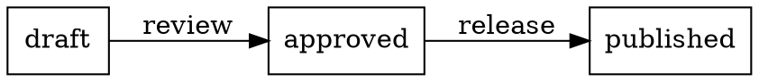
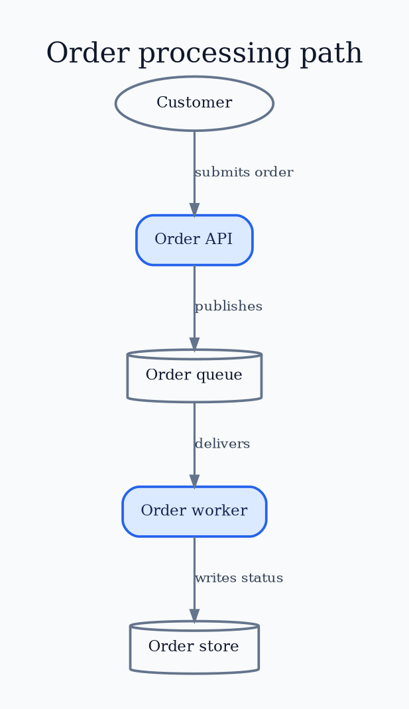

# Graphviz DOT Core

Use DOT when graph topology and automatic layout are central. Keep canonical
source in `.dot` or `.gv`, choose the layout engine deliberately, and render to
PNG for broad delivery.

## Document Shape

A document is `strict` or non-strict and `graph` or `digraph`:



- `graph` uses undirected `--`. `digraph` uses directed `->`. Do not mix them.
- `strict` merges duplicate edges. Later attributes update the existing edge.
  Omit it when parallel relationships are semantically distinct.
- Statements define nodes, edges, attributes, subgraphs, or `name=value`
  assignments. Semicolons and commas are optional but improve dense source.
- IDs can be bare words, numerals, double-quoted strings, or HTML-like strings.
  Quote punctuation, spaces, keywords, and generated IDs consistently.
- Use `//`, `/* ... */`, or a leading `#` line for comments. Keep preprocessor
  lines and concatenated quoted strings out of hand-authored source unless they
  solve a concrete generation problem.

## Statements And Attribute Scope



- `graph [...]`, `node [...]`, and `edge [...]` establish defaults from that
  point forward. Existing objects do not retroactively inherit later defaults.
- A node is created on first mention. Declare important nodes explicitly before
  edges so their attributes are easy to review.
- Edge chains (`a -> b -> c`) and endpoint sets (`a -> {b c}`) are concise.
  Expand them when individual labels or evidence differ.
- Assignments such as `rankdir=LR` are equivalent to graph attributes in the
  current scope. Prefer explicit `graph [...]` blocks in maintained source.
- Subgraphs provide attribute scope and grouping. Only subgraphs whose names
  begin with `cluster` receive cluster treatment in supporting engines.

## Common Attributes

| Target | Practical attributes |
|---|---|
| Graph | `rankdir`, `layout`, `splines`, `overlap`, `compound`, `concentrate`, `nodesep`, `ranksep`, `pad`, `margin`, `bgcolor`, `fontname`, `label`, `labelloc` |
| Node | `label`, `shape`, `style`, `fillcolor`, `color`, `fontcolor`, `width`, `height`, `fixedsize`, `margin`, `image`, `URL`, `tooltip`, `group` |
| Edge | `label`, `xlabel`, `color`, `style`, `penwidth`, `arrowhead`, `arrowtail`, `dir`, `constraint`, `weight`, `minlen`, `headport`, `tailport`, `lhead`, `ltail` |

Attribute availability and meaning can depend on the engine and output format.
Verify the official attribute index. Do not assume that every renderer honors
every value.

## Labels, Escaping, And Encodings

- Ordinary labels use quoted strings. DOT recognizes escapes such as `\n`,
  `\l`, and `\r` in label-like attributes for centered, left-, and right-aligned
  line breaks. Context substitutions such as `\N`, `\G`, `\E`, `\T`, and `\H`
  are attribute-specific.
- Escape embedded quotes and backslashes. Backslash-newline can continue quoted
  strings. `+` concatenates quoted strings. Prefer one readable label when
  generation does not require either feature.
- HTML-like labels use `<...>` and a separate XML-like grammar. Escape XML
  characters, keep nesting valid, and treat image/link content as active input.
- Set `charset="UTF-8"` only when needed. UTF-8 is the practical default. Check
  fonts explicitly for non-Latin text and mathematical symbols.

## Direction, Arrows, And Meaning

- `rankdir=TB`, `BT`, `LR`, or `RL` controls layered reading direction under
  `dot`. Other engines use different geometry controls.
- Keep one main direction. Use `dir=both`, `arrowtail`, or bidirectional-looking
  edges only for genuinely symmetric or two-way relationships.
- Label non-obvious relationships with active verbs. Do not encode ownership,
  protocol, or failure semantics only in arrowheads or color.
- `constraint=false`, `weight`, `minlen`, and invisible edges influence layout.
  Use them as a last-mile semantic constraint, not to draw coordinates by hand.

## Styling And Color

Apply `../design/visual.md`. In DOT, use `style=filled` with a visible border,
and combine rounded fills as `style="rounded,filled"`. Set foreground and
background colors for a fixed asset. Transparent output with fixed dark text
can fail in dark viewers.

DOT has color schemes, gradients, striped/wedged fills, pen widths, dashes, and
custom fonts. Gradients and many-category fills usually add noise. Use them only
when the visual variable itself carries explained meaning. Fixed DOT colors do
not automatically adapt to a different background.

Omit `fontname` from reusable examples so the project or pinned render runtime
owns the default font. When exact typography is a delivery requirement, select
an installed or bundled font in project configuration and verify its license,
glyph coverage, and output in the target runtime.

## Validation And Export

```text
dot -Tpng -Gdpi=192 diagram.dot -o diagram.png
```

Use the selected engine in place of `dot` when needed. Confirm that the command
succeeds and inspect the PNG at its intended size for correct content, readable
labels, and obvious clipping or overlap.

Sources: [DOT language](https://graphviz.org/doc/info/lang.html),
[attributes](https://graphviz.org/doc/info/attrs.html),
[shapes](https://graphviz.org/doc/info/shapes.html),
[colors](https://graphviz.org/doc/info/colors.html), and
[output formats](https://graphviz.org/docs/outputs/).
