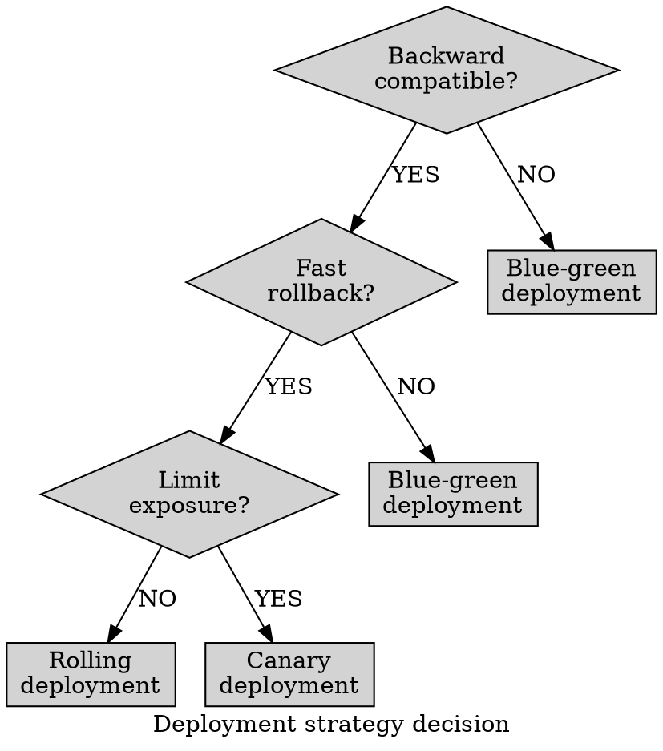

# Graphviz Decision Trees

Phrase decisions as answerable questions and label every outgoing branch with
consistent vocabulary. Duplicate a recommendation leaf when the view must stay
a true tree; merge it only for an intentional decision DAG. Treat leaves as
recommendations only when assumptions are documented.

Sources: [DOT language](https://graphviz.org/doc/info/lang.html) and
[`dot` layout](https://graphviz.org/docs/layouts/dot/).
