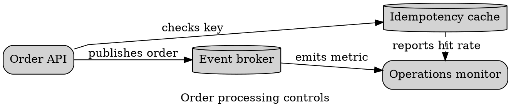

# Graphviz Edge Routing

Use edge controls to resolve a specific ambiguity, not to typeset the whole
graph manually.

- `label` participates in layout; `xlabel` is placed afterward and can overlap.
- `constraint=false` removes an edge from rank assignment but keeps it visible.
- `weight` and `minlen` influence rather than guarantee geometry.
- `splines` values include `spline`, `polyline`, `ortho`, `curved`, `line`, and
  `false`; support varies by engine. Orthogonal labels have known limitations.
- `concentrate=true` can merge routes and hide individual relationships.

Force-directed and circular engines optimize topology, not edge-label
clearance. Prefer one homogeneous edge meaning. Reify essential relationship
types as nodes or use a focused `dot` view. Reject labels that touch nodes,
cross edges, overlap, or become ambiguous at final size. Do not hide collisions
with tiny text or arbitrary coordinates. Route reciprocal edges distinctly;
use `dir=both` only for one symmetric relationship.

Sources: [Graphviz attributes](https://graphviz.org/doc/info/attrs.html) and
[arrow shapes](https://graphviz.org/doc/info/arrows.html).
