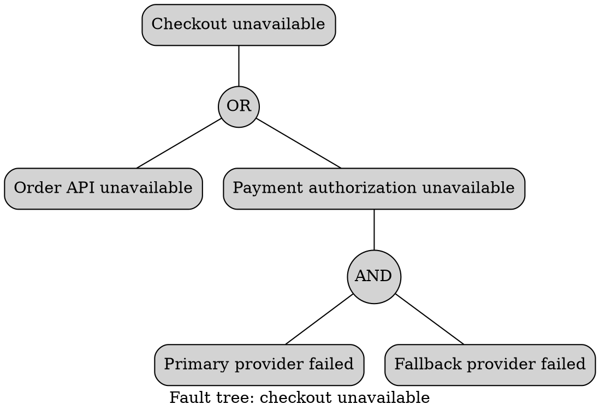

# Graphviz Fault Trees

Preserve the domain's direction and gate semantics. Text in generic gate
circles is readable documentation, not formal interchange notation. Use a
specialized tool when standard glyphs, probability calculation, or
certification is required. Do not use color alone to distinguish faults.

Sources: [DOT language](https://graphviz.org/doc/info/lang.html) and
[node shapes](https://graphviz.org/doc/info/shapes.html).
