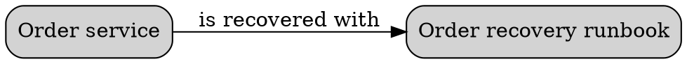

# Graphviz Interactive Content

Graphviz supports `URL` or `href`, `tooltip`, `target`, `image`, and related
attributes, but behavior depends on the output format.

PNG does not preserve links or tooltips, so keep useful links in surrounding
text. Before processing links, images, fonts, or externally supplied DOT, apply
`../delivery/security.md`. Review local assets and remote URLs explicitly.

Sources: [Graphviz attributes](https://graphviz.org/doc/info/attrs.html) and
[output formats](https://graphviz.org/docs/outputs/).
