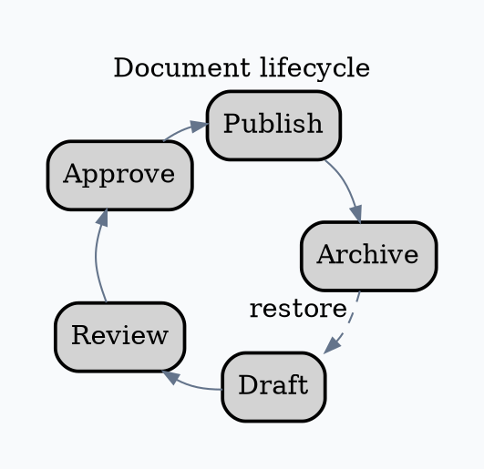

# Graphviz `circo` Layout

Use `circo` when a cycle or ring is the subject.

Run `circo -Tpng input.dot -o output.png`. Cross-ring chords and edge labels
can tangle. If the cycle is incidental to one dominant process, use `dot`.

Source: [`circo` layout](https://graphviz.org/docs/layouts/circo/).
