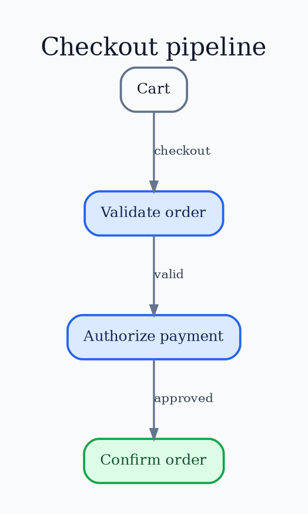

# Graphviz `dot` Layout

Use `dot` for layered directed processes, dependencies, and hierarchies.

Run `dot -Tpng input.dot -o output.png`. Use `rankdir`, `rank`, `nodesep`,
`ranksep`, `minlen`, `weight`, and `constraint` carefully. Back edges and wide
layers are common failure modes.

Source: [`dot` layout](https://graphviz.org/docs/layouts/dot/).
