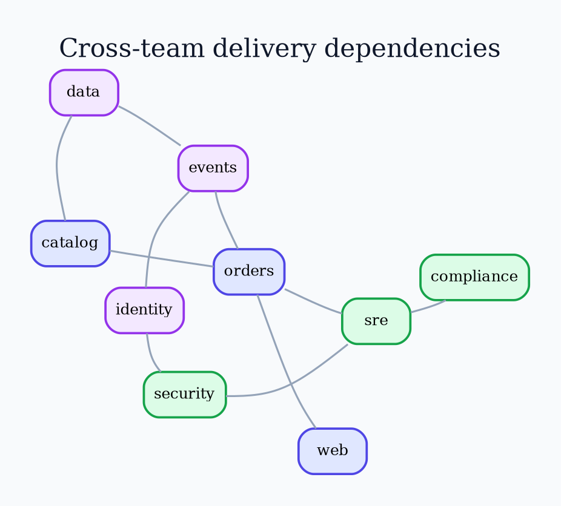

# Graphviz `fdp` Layout

Use `fdp` for medium undirected clustered networks.

Run `fdp -Tpng input.dot -o output.png`. Tune `K` only when default spacing
fails. Filter, cluster, or split a dense network before styling.

Source: [`fdp` layout](https://graphviz.org/docs/layouts/fdp/).
