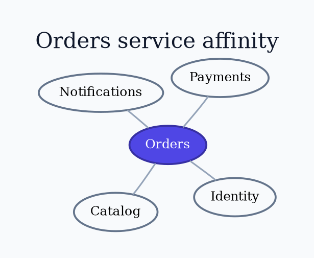

# Graphviz `neato` Layout

Use `neato` for small undirected networks and geometric relationships.

Run `neato -Tpng input.dot -o output.png`. A numeric `start` is repeatable only
within a pinned build. Use `pos` with `-n` or `-n2` only when coordinates are
deliberately owned. Treat distance as a metric only when the model defines it.

Source: [`neato` layout](https://graphviz.org/docs/layouts/neato/).
