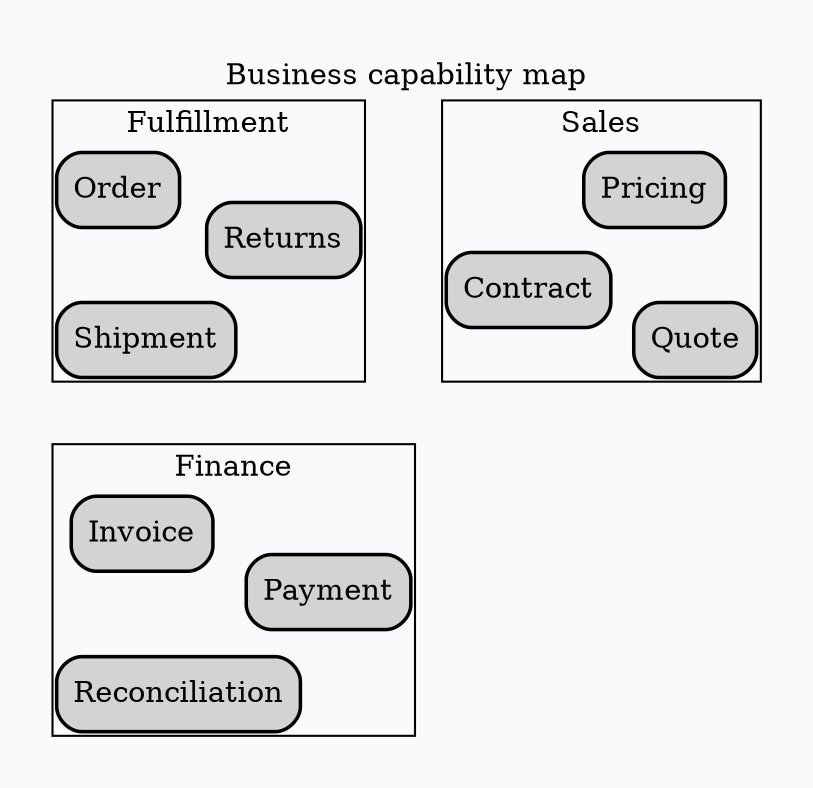

# Graphviz `osage` Layout

Use `osage` for recursively packed clusters or array-like grouped structures.

Run `osage -Tpng input.dot -o output.png`. It emphasizes nested grouping and
packing, not sequence or directional dependency.

Source: [`osage` layout](https://graphviz.org/docs/layouts/osage/).
