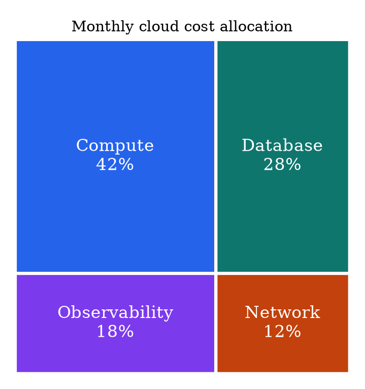

# Graphviz `patchwork` Layout

Use `patchwork` for a small hierarchical area or part-to-whole view.

Run `patchwork -Tpng input.dot -o output.png`. `area` controls rectangle size.
Print exact values and keep the dataset small. Area and labels, not hue, encode
magnitude. Use a charting workflow for substantial quantitative analysis.

Source: [`patchwork` layout](https://graphviz.org/docs/layouts/patchwork/).
