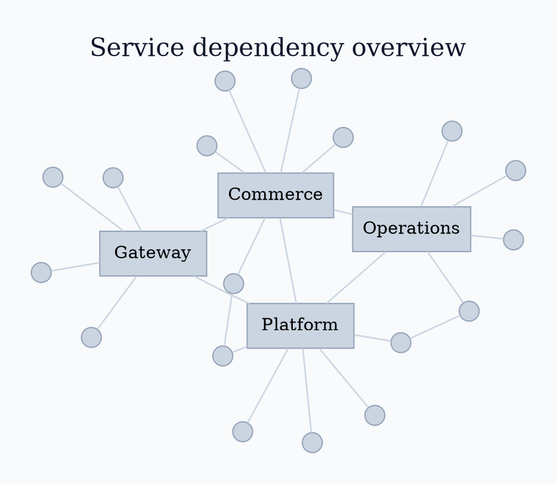

# Graphviz `sfdp` Layout

Use `sfdp` for large overview-scale undirected graphs.

Run `sfdp -Tpng input.dot -o output.png`. Reduce label vocabulary and expose
detail through linked views. Do not claim that visual proximity alone proves
architectural coupling.

Source: [`sfdp` layout](https://graphviz.org/docs/layouts/sfdp/).
