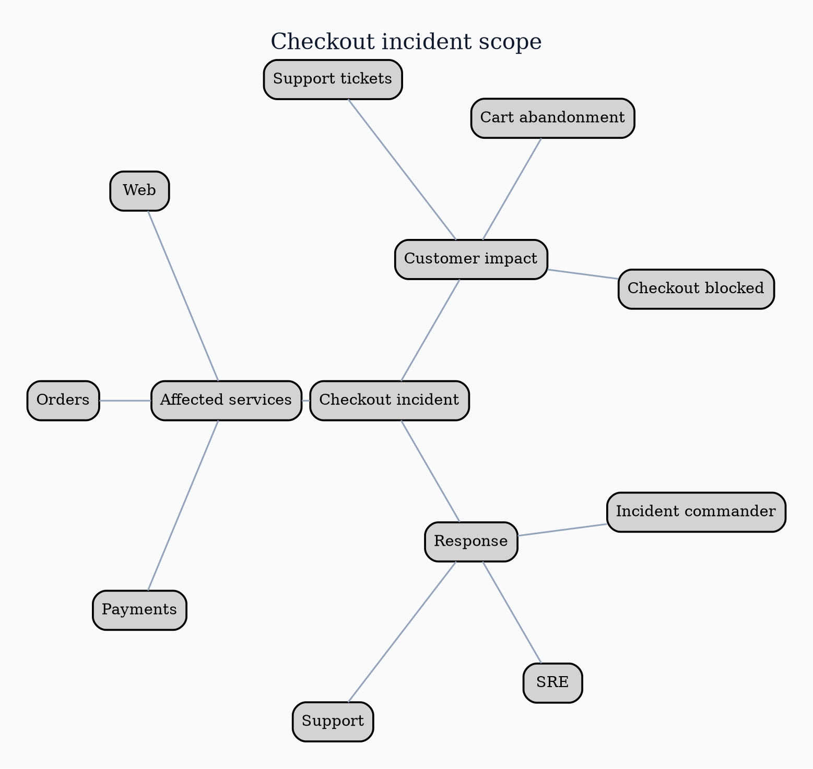

# Graphviz `twopi` Layout

Use `twopi` for a radial hierarchy around one meaningful center.

Run `twopi -Tpng input.dot -o output.png`. Set a meaningful `root`. Radial
distance indicates levels, not elapsed time or quantitative magnitude. Long
labels commonly collide around rings.

Source: [`twopi` layout](https://graphviz.org/docs/layouts/twopi/).
