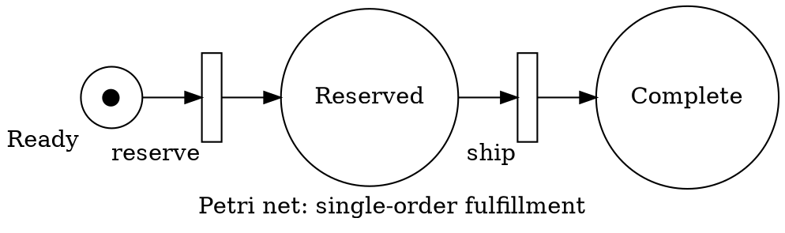

# Graphviz Petri Nets

Places are circles and transitions are bars or narrow rectangles. Arcs connect
places to transitions, never like to like. Mark tokens explicitly and provide
a textual initial marking; here it is one token in `Ready`. Label arc weights
greater than one. Use a specialized Petri-net tool for reachability, liveness,
simulation, or interchange validation.

Source: [ISO/IEC 15909-2](https://www.iso.org/standard/67235.html).
