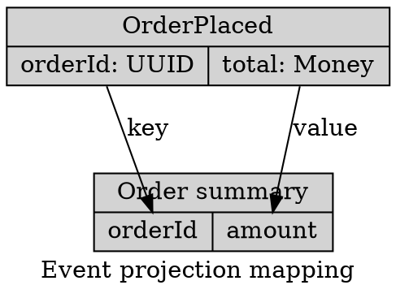
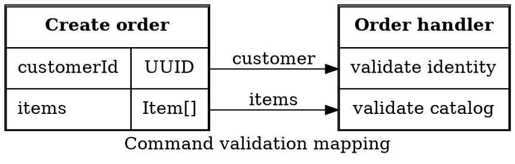

# Graphviz Ports And Rich Labels

Use record labels for compact field structure and HTML-like labels for precise,
shallow table composition.

## Record Labels

A field port is `<portName>`; attach through `node:port` and optionally a
compass point. Escape literal record delimiters. Record routing is limited with
some rank directions and non-`dot` engines.

## HTML-Like Table Labels

HTML-like labels use Graphviz's XML-like grammar, not HTML. Balance tags,
escape XML-sensitive text, quote attributes, keep tables shallow, and provide
the same information in an accessibility description.

Sources: [node shapes](https://graphviz.org/doc/info/shapes.html) and
[attributes](https://graphviz.org/doc/info/attrs.html).
