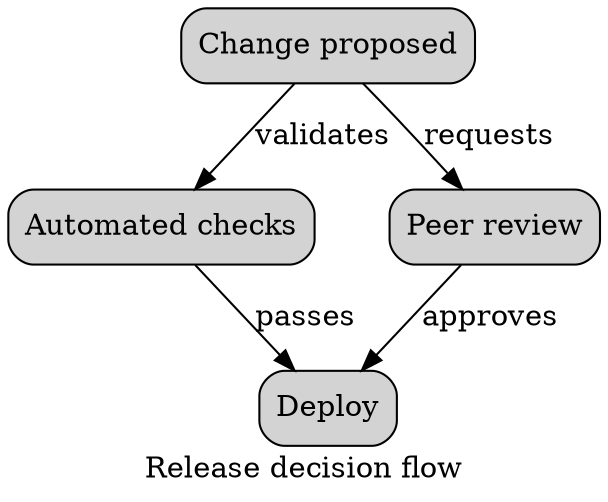

# Graphviz Ranks

Use ranks to align peers and stabilize reading order under `dot`.

`rank=same`, `rank=min`, `rank=max`, `rank=source`, and `rank=sink` affect
placement. Prefer semantic ranks over long invisible-edge chains. Comment every
invisible constraint and recheck the render because hidden constraints can
distort edge lengths.

Source: [Graphviz attributes](https://graphviz.org/doc/info/attrs.html).
