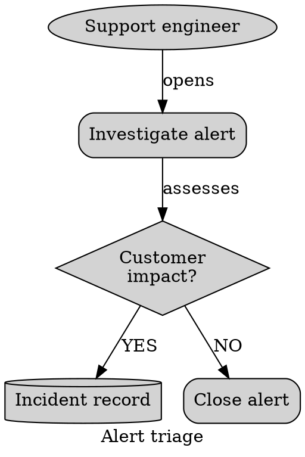

# Graphviz Semantic Shapes

Use a small familiar shape vocabulary as supplementary meaning.

Labels carry primary meaning; shapes reinforce category. Avoid exotic shapes
merely because Graphviz provides them. Check long text for crowding or clipping.

Source: [Graphviz node shapes](https://graphviz.org/doc/info/shapes.html).
