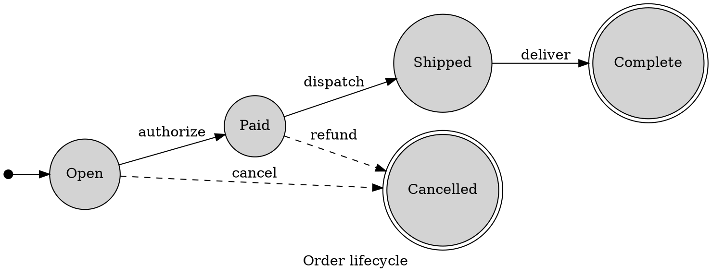

# Graphviz Labeled Transition Systems

Use DOT for a labeled transition system when graph-level control matters more
than UML composite states or entry and exit actions.

State whether double circles mean accepting, terminal, or another domain
property; an LTS does not define that convention. Label every transition and
keep domain notation primary. Use Mermaid state diagrams when UML semantics are
more important than graph layout control.

Sources: [DOT language](https://graphviz.org/doc/info/lang.html) and
[node shapes](https://graphviz.org/doc/info/shapes.html).
