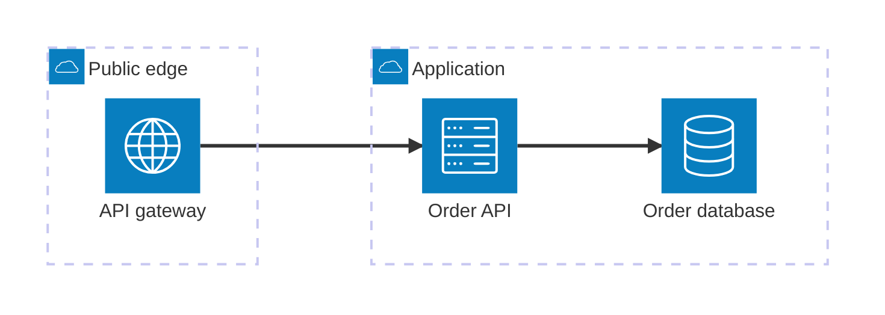

# Mermaid Architecture

Use `architecture-beta` for cloud, service, and resource topology when groups,
icons, ports, and junctions add meaning. Statements include `group`, `service`,
and `junction`; edges attach through `T`, `B`, `L`, and `R` ports. Built-in
icons require a compatible Mermaid version and registered packs are
host-dependent.

Keep labels short and put official service names near vendor icons. Use `align
row` or `align column` only for a meaningful grid. Accept natural whitespace;
when fixed placement weakens hierarchy, use a flowchart or another architecture
language. Inspect icon contrast on the intended background. For an unsupported
platform, render locally and retain the source.

Source: [Mermaid architecture](https://mermaid.js.org/syntax/architecture.html).
