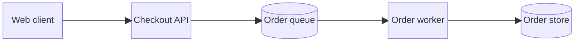

# Mermaid Block Diagram

Use `block-beta` when an explicit grid communicates block architecture better
than automatic graph layout. `columns`, `space`, nested `block`, shapes, and
edges control composition. Prefer a flowchart when manual placement adds no
meaning.

Keep connected elements in adjacent cells. Use empty space deliberately and
inspect narrow output. A single-row pipeline keeps edges aligned; use multiple
rows only for real tiers or zones. Avoid spacer cells that force diagonal
edges.

Source: [Mermaid block diagrams](https://mermaid.js.org/syntax/block.html).
