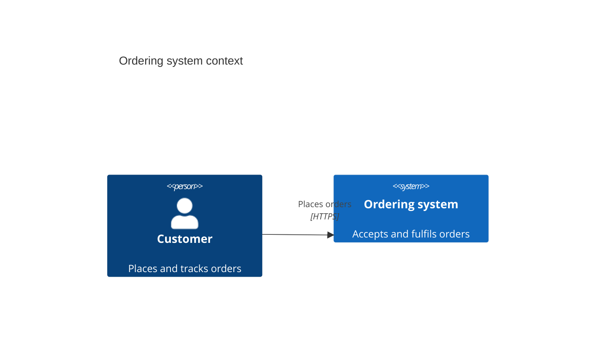

# Mermaid C4

Use one C4 abstraction level per diagram. Declarations include `C4Context`,
`C4Container`, `C4Component`, `C4Dynamic`, and `C4Deployment`. Mermaid C4 is
experimental and uses fixed styling and statement-order layout.

Show title, type, scope, element names, responsibilities, relevant technology,
expanded acronyms, and relationship labels. Do not mix container internals into
a context view. Keep the view small; use `UpdateRelStyle` for label placement
and `UpdateLayoutConfig` only for row density. Split when fixed shapes,
whitespace, labels, or contrast reduce clarity.

Sources: [Mermaid C4](https://mermaid.js.org/syntax/c4.html) and
[C4 notation](https://c4model.com/diagrams/notation).
