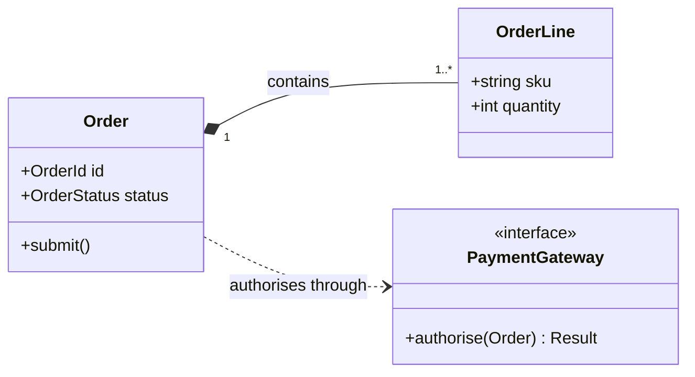

# Mermaid Class Diagram

Use `classDiagram` for object, interface, or domain type structure. Classes can
contain relevant attributes and methods. Relationships express inheritance,
composition, aggregation, association, dependency, realization, multiplicity,
and labels.

Use `LR` for a short dependency spine and `TB` for inheritance or parent-child
decomposition. Put the most referenced type near the center. Show only members
that answer the question, use conventional arrow meanings, and do not turn the
view into generated API documentation.

Source: [Mermaid class diagram](https://mermaid.js.org/syntax/classDiagram.html).
