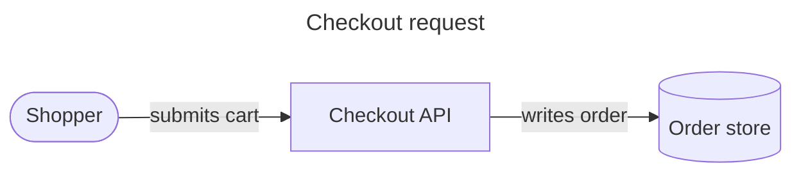

# Mermaid Core Authoring

This file covers syntax shared across families. Family-specific references own
their grammar and examples.

## Source Shape

A diagram starts with one declaration. Use `%%` for a line comment. Unknown
keywords break parsing. Misspelled configuration keys can fail silently.



Use quoted labels for punctuation, Markdown strings, and parser-sensitive words.
The lowercase word `end` can break flowchart and sequence parsing when used as
an unquoted identifier or label. Keep stable short IDs separate from display
labels.

## Frontmatter And Configuration

YAML frontmatter must begin on the first line and uses case-sensitive keys.
Prefer frontmatter over deprecated initialization directives. Important shared
controls include:

- `theme`: built-in themes include `default`, `neutral`, `dark`, `forest`, and
  `base`. Only `base` is intended for custom `themeVariables`.
- Omit `theme` from portable source when the host or build selects light, dark,
  high-contrast, or print output. A source-level theme overrides CLI theme
  selection and can make text or fills unreadable on another background. Fix a
  theme only for a rendered asset with an explicit matching background.
- `look`: `classic` or `handDrawn` where supported. Use hand-drawn style for
  workshops or provisional concepts, not as a default architecture aesthetic.
- `layout`: `dagre`, `elk`, `tidy-tree`, or `cose-bilkent` when the family and
  host bundle support them. ELK is not automatically present in every embed.
- family keys such as `flowchart`, `sequence`, `gantt`, or `radar` for local
  options.
- `securityLevel`: host-owned in most Markdown integrations. Do not weaken it
  merely to enable links or HTML.

Directives in `%%{init: ...}%%` still appear in older source but are less
portable. Use them only for a verified legacy renderer.

## Controlled PNG Profile

Keep native Markdown theme-adaptive. For a fixed light-background PNG, put the
configuration below in one renderer-owned `mermaid-png.json`. Do not copy theme
frontmatter into every diagram. The base is deliberately neutral. The quadrant
colors are semantic categories for the prioritization example, not a license to
assign a different color to every node.

```json
{
  "theme": "base",
  "look": "classic",
  "themeVariables": {
    "fontFamily": "Inter, Segoe UI, sans-serif",
    "background": "#FFFFFF",
    "primaryColor": "#F8FAFC",
    "primaryBorderColor": "#64748B",
    "primaryTextColor": "#0F172A",
    "secondaryColor": "#D8E3FB",
    "secondaryBorderColor": "#2563EB",
    "secondaryTextColor": "#102A63",
    "tertiaryColor": "#F8E7D2",
    "tertiaryBorderColor": "#D97706",
    "tertiaryTextColor": "#5B3203",
    "lineColor": "#475569",
    "textColor": "#0F172A",
    "quadrant1Fill": "#F8E7D2",
    "quadrant1TextFill": "#5B3203",
    "quadrant2Fill": "#D5E8DC",
    "quadrant2TextFill": "#09361A",
    "quadrant3Fill": "#F8FAFC",
    "quadrant3TextFill": "#0F172A",
    "quadrant4Fill": "#E7DCFC",
    "quadrant4TextFill": "#341864",
    "quadrantPointFill": "#2563EB",
    "quadrantPointTextFill": "#0F172A",
    "quadrantInternalBorderStrokeFill": "#94A3B8",
    "quadrantExternalBorderStrokeFill": "#64748B"
  },
  "flowchart": {
    "curve": "linear",
    "nodeSpacing": 48,
    "rankSpacing": 56,
    "padding": 16,
    "wrappingWidth": 180
  }
}
```

Render with an explicit white background and inspect the natural aspect ratio:

```text
mmdc -i diagram.mmd -o diagram.png -c mermaid-png.json -b white -s 2
```

Use the profile as a starting point, not as source-level policy. Remove unused
semantic accents, keep ordinary edges quiet, and create a separate reviewed
dark profile when the destination requires one. A hosted Mermaid destination will not
load this local JSON. Retain portable source or publish the reviewed PNG.

## Labels, Styling, And Links

| Need | Practical fragment | Portability note |
|---|---|---|
| Stable ID and quoted label | `api["Checkout API (v2)"]` | Keep the ID short. Quote punctuation and parser-sensitive words |
| Literal special character | `cost["Priority #35;1"]` | Mermaid entity codes such as `#35;` are safer than raw parser delimiters. Verify the family |
| Reusable class | `classDef external stroke-width:2px,stroke-dasharray:5 3` then `class payments external` | Prefer structural, theme-adaptive properties. Fixed colors need theme review |
| Edge styling | `linkStyle 0 stroke-width:2px` | Indexes are source-order sensitive. Use sparingly |
| Link | `click docs "https://example.com/docs" "Open documentation"` | Host security policy can disable links. Keep the URL visible nearby when essential |

Do not backslash-escape Mermaid blindly: escaping rules differ between YAML,
Markdown fences, Mermaid grammars, HTML/entity processing, and host Markdown.
Prefer stable IDs, quoted labels, and supported entity codes. Render the exact
final fence after any documentation templating.

- Use Markdown strings only when ordinary quoted labels are insufficient.
- Prefer structure, labels, and a small number of semantic classes. Inline
  `style` statements are harder to reuse and audit than `classDef`.
- Keep fills vivid but purposeful, borders visible, and text contrast robust.
  Avoid fixed colors in native Markdown when the host controls the theme.
- Use `linkStyle` sparingly and keep edge meaning in labels or line patterns.
- `click` links, HTML labels, images, and custom CSS depend on the host security
  policy and are not portable.
- Math rendering uses KaTeX, which requires host support. Use plain Unicode or
  text when it communicates as well as mathematics.

## Icons

Flowchart and architecture icon syntax relies on registered packs. Architecture
has five built-ins: `cloud`, `database`, `disk`, `internet`, and `server`.
The embedding application must register external Iconify packs. Render locally
or use labeled shapes when the platform cannot register them.

## Accessibility

Use `accTitle` and `accDescr` inside the diagram where supported. The title
identifies the view. The description states its essential meaning rather than
listing every visual coordinate. Complex diagrams also need a nearby structured
description. Keep node and relationship labels meaningful without color.

## Validation

```text
mmdc -i diagram.mmd -o diagram.png -b white -s 2
```

Inspect the PNG at its intended display size. Confirm that it has the right
content and that labels, icons, edges, and contrast are readable. Check the
embedded Mermaid version only when the destination rejects otherwise valid
source.

Sources: [syntax structure](https://mermaid.js.org/intro/syntax-reference.html),
[configuration](https://mermaid.js.org/config/configuration.html),
[theming](https://mermaid.js.org/config/theming),
[layouts](https://mermaid.js.org/config/layouts),
[icons](https://mermaid.js.org/config/icons.html),
[math](https://mermaid.js.org/config/math.html), and
[accessibility](https://mermaid.js.org/config/accessibility.html).
