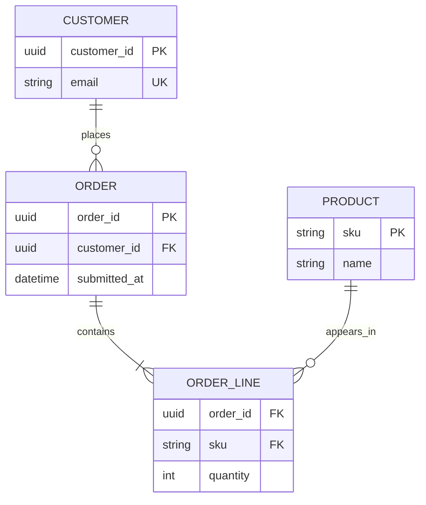

# Mermaid Entity Relationship Diagram

Use `erDiagram` for entities, relevant attributes, identifying or
non-identifying relationships, cardinality, and relationship labels. Attribute
keys include `PK`, `FK`, and `UK`.

State whether the view is conceptual, logical, or physical. Use `LR` for a
short relationship spine and `TB` for parent-child decomposition. Do not dump
every column when relationships are the question. Upstream still labels ER
experimental; verify the pinned renderer for durable or normative schema work.

Source: [Mermaid ER diagram](https://mermaid.js.org/syntax/entityRelationshipDiagram.html).
