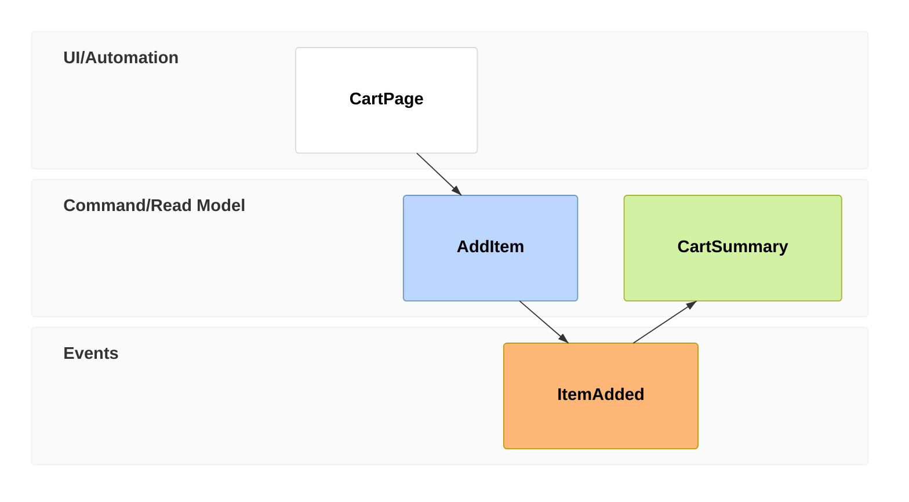

# Mermaid Event Modeling

Use `eventmodeling` for information flow over time through UI, commands, events,
read models, and processors. Timeframes accept compact (`tf`, `ui`, `cmd`,
`evt`, `rmo`, `pcr`) or relaxed keywords. Relations are inferred by the
grammar.

Model one coherent slice. Name events in past tense, commands imperatively, and
views for the information readers consume. This family requires a current
renderer and can evolve. In Mermaid 11.16, a body-level `title` is invalid;
use surrounding Markdown or verified YAML frontmatter. Use `rmo` or
`readmodel`, not `view`, and one declaration per source block.

Source: [Mermaid event modeling](https://mermaid.js.org/syntax/eventmodeling.html).
