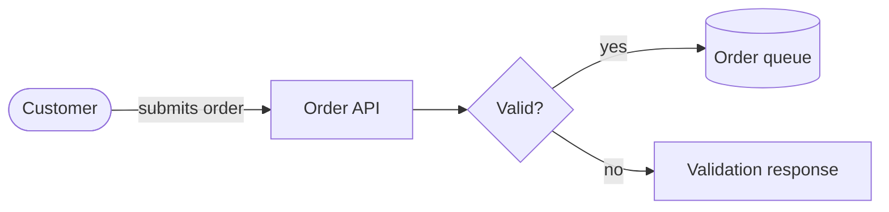

# Mermaid Flowchart

Use `flowchart` or `graph` for dependencies, decisions, data flow, and compact
architecture. Set `TB`, `BT`, `LR`, or `RL`, give nodes stable IDs, group only
real boundaries with `subgraph`, and label non-obvious edges. Target-specific
syntax belongs to the applicable platform profile.

Use `LR` for pipelines and request paths and `TB` for decomposition and decision
trees. Keep the main path straight and exceptions at the perimeter. In a
controlled PNG profile, start near 48 pixels of node spacing and 56 pixels of
rank spacing; change one value only when labels or boundaries collide.

Avoid edges that reverse through the primary flow, large cross-linked
subgraphs, unlabeled outcomes, invisible spacer nodes, and styling every node.

Source: [Mermaid flowchart](https://mermaid.js.org/syntax/flowchart.html).
