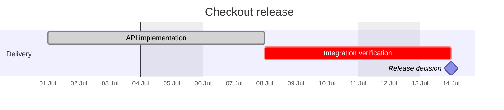

# Mermaid Gantt

Use `gantt` for tasks, dates, durations, dependencies, milestones, and
exclusions. Directives include `dateFormat`, `axisFormat`, `tickInterval`,
`excludes`, `includes`, and `todayMarker`; tags include `done`, `active`,
`crit`, and `milestone`.

Declare the time basis and exclusions. Give horizontal schedules enough
viewport width before increasing scale. Avoid false precision, excessive color
states, and a task list too dense for publication width.

Source: [Mermaid Gantt](https://mermaid.js.org/syntax/gantt.html).
