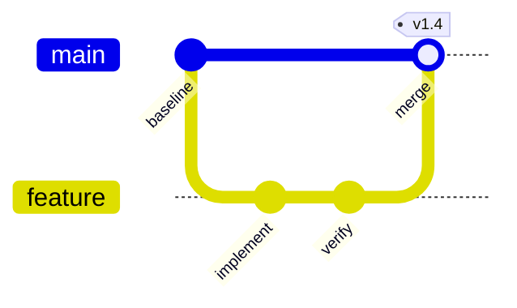

# Mermaid GitGraph

Use `gitGraph` for a small branch, merge, or release narrative. Commands include
`commit`, `branch`, `checkout` or `switch`, `merge`, and `cherry-pick`.

Use a real or explicitly illustrative history. Avoid reproducing a large log.
An orientation suffix requires its trailing colon: `gitGraph LR:`,
`gitGraph TB:`, or `gitGraph BT:`. Let the selected Mermaid theme supply branch
colors for portable source; use `git0`–`git7` only for a fixed reviewed asset.

Source: [Mermaid GitGraph](https://mermaid.js.org/syntax/gitgraph.html).
