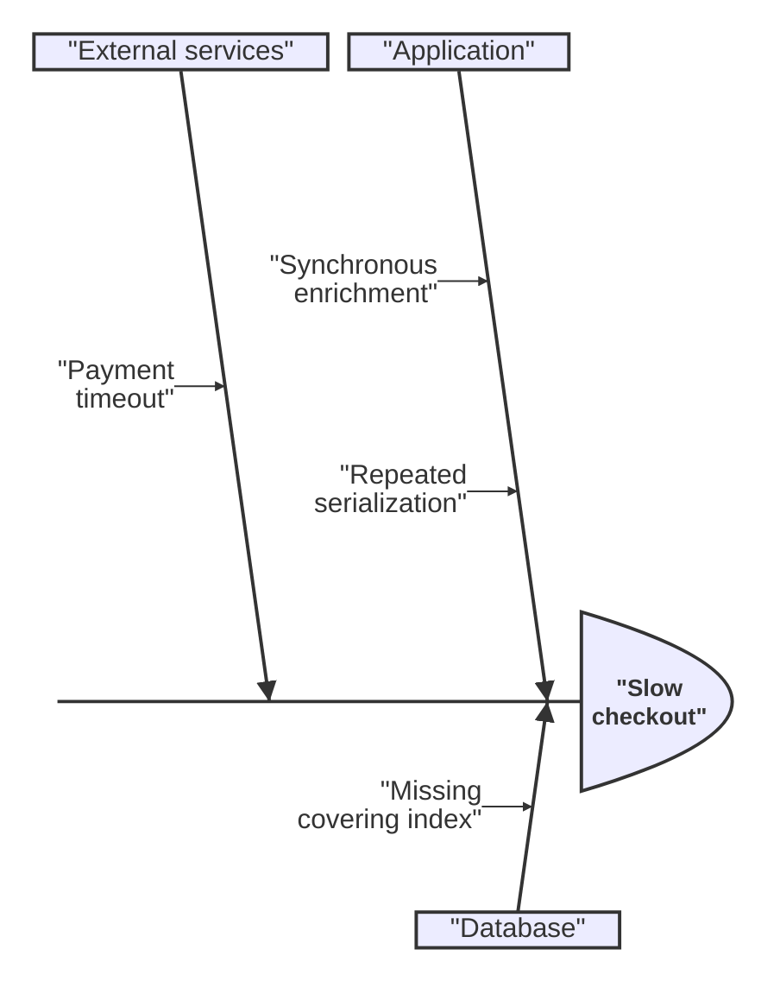

# Mermaid Ishikawa Diagram

Use `ishikawa-beta` for structured cause exploration. The first indented
hierarchy names the effect and its cause categories; deeper indentation adds
causes.

Treat causes as hypotheses until evidence supports them. Keep categories
parallel and avoid an unprioritized backlog. Mermaid 11.16 can expose literal
delimiters or a narrow spine; use a labeled cause tree or verified renderer
when fishbone notation is not essential.

Source: [Mermaid Ishikawa](https://mermaid.js.org/syntax/ishikawa.html).
