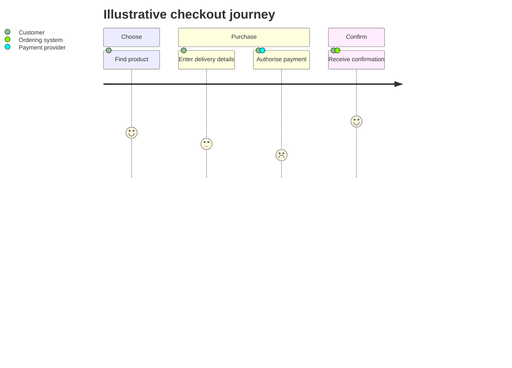

# Mermaid User Journey

Use `journey` for one persona's steps, participants, and relative satisfaction
or effort. Declare a title, group steps into sections, and write each step as
`Task: score: actors`.

Use one persona goal, consistent scoring, and evidence-backed steps. Scores are
relative unless the method says otherwise. Mermaid reserves vertical space for
the score scale; use a flowchart or table if that structure is irrelevant. For
a wide local PNG, increase viewport width before scale and inspect blank
margins. Do not publish a stretched default viewport.

Source: [Mermaid user journey](https://mermaid.js.org/syntax/userJourney.html).
