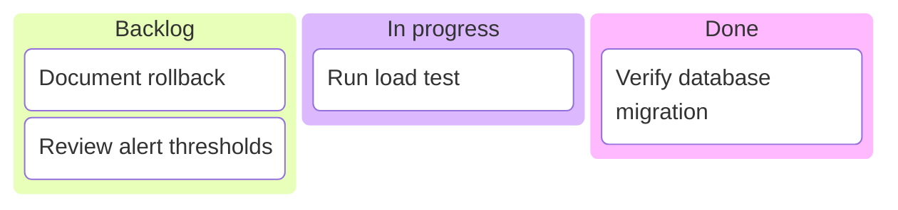

# Mermaid Kanban

Use `kanban` for a small snapshot of work by workflow column. Top-level nodes
create columns and indented nodes create cards. Compatible renderers support
ticket, assignee, priority, and icon metadata.

Use stable workflow states and short cards. Keep columns comparable in meaning
and item count; split when one dominates or cards wrap. This is a communication
snapshot, not a replacement for the authoritative work-tracking system.

Source: [Mermaid Kanban](https://mermaid.js.org/syntax/kanban.html).
