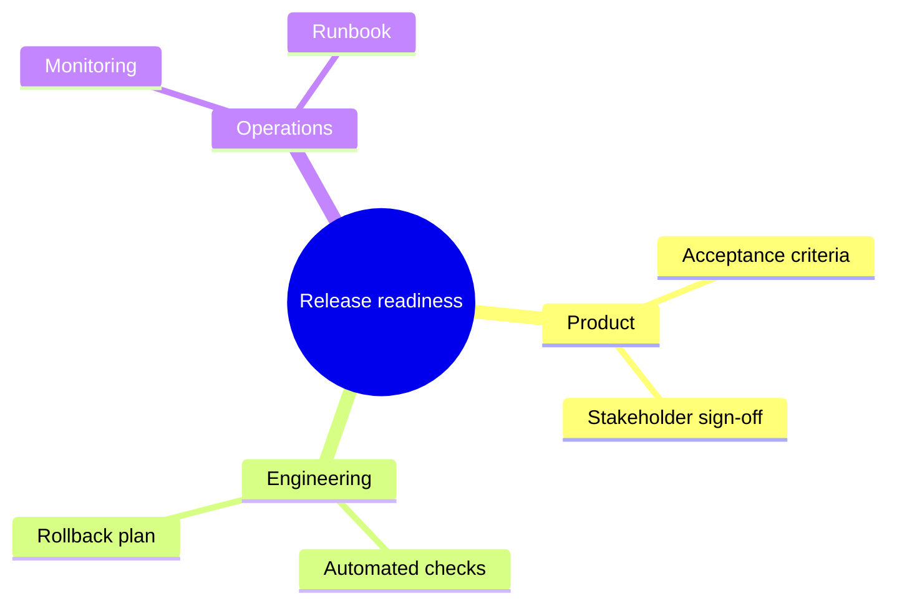

# Mermaid Mindmap

Use `mindmap` for one rooted hierarchy or brainstorming structure. Indentation
defines parentage. Shapes, icons, classes, Markdown strings, and the `tidy-tree`
layout are renderer-dependent.

Keep one root, parallel sibling labels, and consistent depth. Split before
leaves wrap or the root dominates the page. Use another family when cross-links
or sequence are central.

Source: [Mermaid mindmap](https://mermaid.js.org/syntax/mindmap.html).
