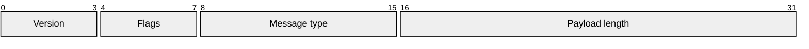

# Mermaid Packet Diagram

Use `packet-beta` for ordered protocol or binary fields. Each line maps an
inclusive bit range to a label. Configuration controls row width, bit width,
padding, and display.

Keep ranges contiguous unless gaps are meaningful. Declare bit order in nearby
text and use another artifact for large normative protocol specifications.
Reduce scope and label length before increasing the canvas.

Source: [Mermaid packet diagram](https://mermaid.js.org/syntax/packet.html).
