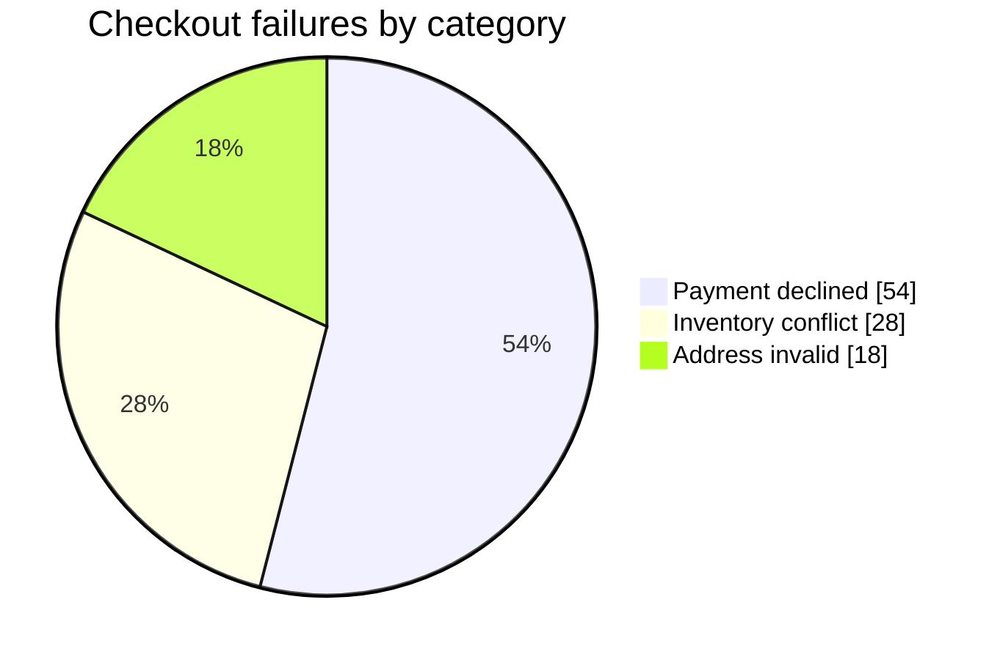

# Mermaid Pie Chart

Use `pie` only for a few non-negative parts of one whole. `showData` displays
values; labels are quoted and values follow a colon.

State the takeaway, units, provenance, and whether values are measured or
illustrative. Preserve the data in prose or a table. Avoid many slices, similar
colors, three-dimensional effects, or incompatible bases. Prefer a bar chart
for close comparisons.

Source: [Mermaid pie chart](https://mermaid.js.org/syntax/pie.html).
