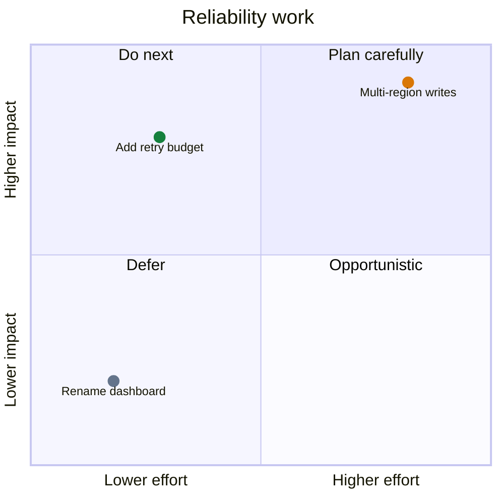

# Mermaid Quadrant Chart

Use `quadrantChart` for two-axis prioritization. Declare meaningful endpoints,
name all quadrants, and place points with normalized `[x, y]` coordinates.

Explain how positions were determined; do not present subjective placement as
measurement. Keep labels because color is supplementary. For a fixed PNG, use
the controlled profile in `core.md`; native host output remains valid without
it.

Source: [Mermaid quadrant chart](https://mermaid.js.org/syntax/quadrantChart.html).
