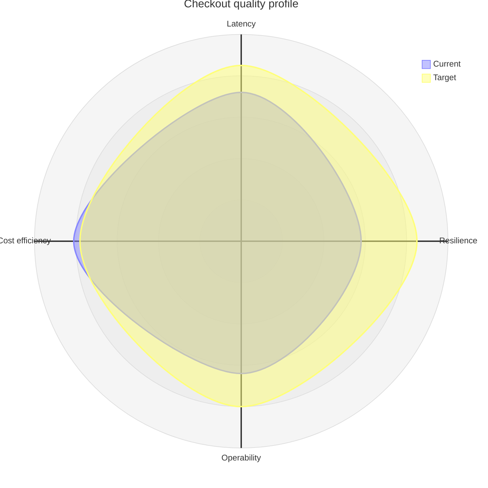

# Mermaid Radar Chart

Use `radar-beta` for a few entities across a small common set of dimensions.
Define axis IDs and labels, curve values, and explicit scale and legend
controls when comparisons require stability.

Use identical scales and direction for every axis. Avoid area-based conclusions
and many overlapping curves. Preserve the underlying values in accessible
text. This family is renderer-sensitive.

Source: [Mermaid radar chart](https://mermaid.js.org/syntax/radar.html).
