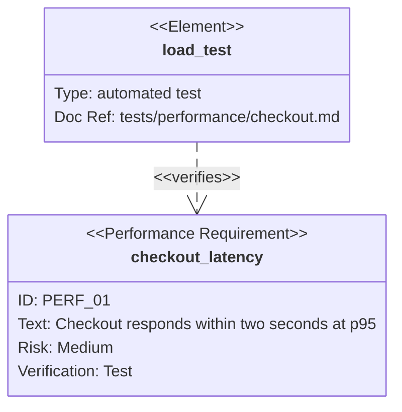

# Mermaid Requirement Diagram

Use `requirementDiagram` for traceability between requirements and design or
test elements. Requirements support `id`, `text`, `risk`, and `verifymethod`.
Relations include `contains`, `copies`, `derives`, `satisfies`, `verifies`,
`refines`, and `traces`.

Use stable requirement IDs and real verification artifacts. Do not invent
traceability to make the picture complete. Reduce scope and label length before
increasing the canvas.

Source: [Mermaid requirement diagram](https://mermaid.js.org/syntax/requirementDiagram.html).
