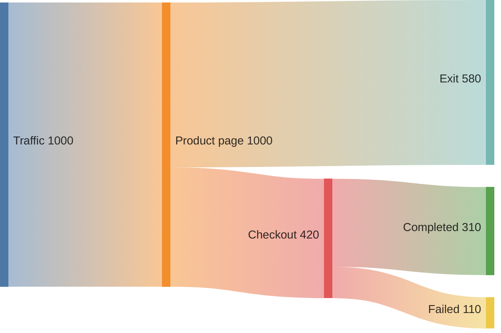

# Mermaid Sankey

Use `sankey-beta` for conserved or comparable quantities flowing between
stages. Source is CSV-like `source,target,value`; quote fields containing
commas or quotation marks.

State units and period, keep stages ordered, combine negligible flows, and do
not imply conservation across incompatible bases. Preserve accessible data in
prose or a table. This family is renderer-sensitive; split or simplify when
curves obscure identity or labels collide.

Source: [Mermaid Sankey](https://mermaid.js.org/syntax/sankey.html).
