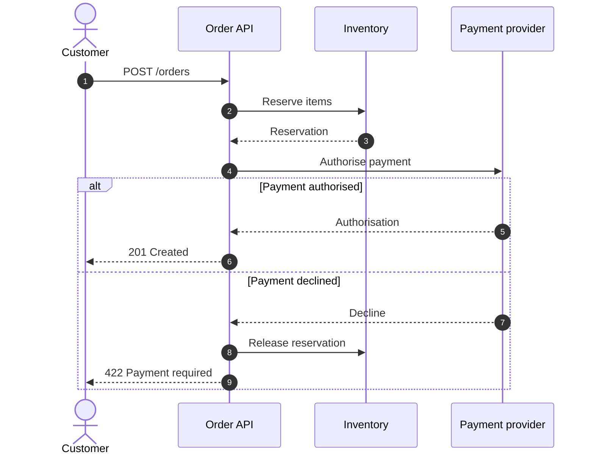

# Mermaid Sequence Diagram

Use `sequenceDiagram` for one ordered scenario. Declare participant order, use
actors only for people, and label every message. Available constructs include
activation, notes, loops, alternatives, options, parallel or critical regions,
breaks, participant boxes, creation and destruction, and autonumbering.

Keep one scenario, stable participant order, and short messages. A tall image
is preferable to squeezed labels. Split unrelated use cases and avoid long
self-calls, decorative activation bars, or prose-sized messages.

Source: [Mermaid sequence diagram](https://mermaid.js.org/syntax/sequenceDiagram.html).
