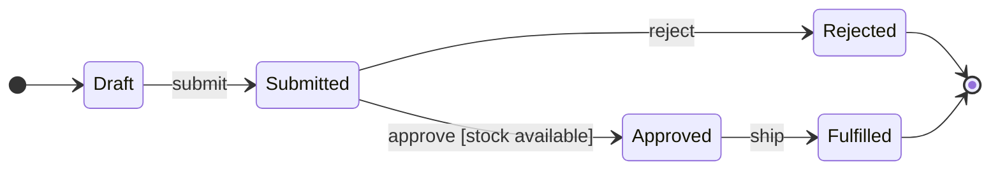

# Mermaid State Diagram

Use `stateDiagram-v2` for the lifecycle of one entity or subsystem. Include
initial and final states, events and guards, composite states, choices,
forks/joins, notes, concurrency, and direction only when they clarify behavior.

Keep one dominant transition direction. Put the success path on the primary
line and rejection or cancellation beside it. Name conditions on transitions,
not as states. Separate independent machines, make terminal paths explicit,
and split when reciprocal or self-transitions make labels ambiguous.

Source: [Mermaid state diagram](https://mermaid.js.org/syntax/stateDiagram.html).
