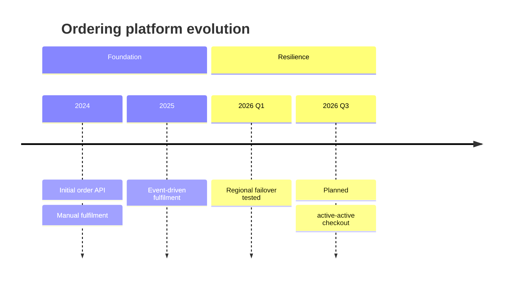

# Mermaid Timeline

Use `timeline` for chronological events when duration and dependencies are not
the question. Sections group periods or themes and events can carry several
lines of detail.

Keep granularity consistent within a section and distinguish planned from
historical events in labels or separate views. Control density through scope,
label length, sections, and viewport rather than spacer content or CSS nudges.

Source: [Mermaid timeline](https://mermaid.js.org/syntax/timeline.html).
