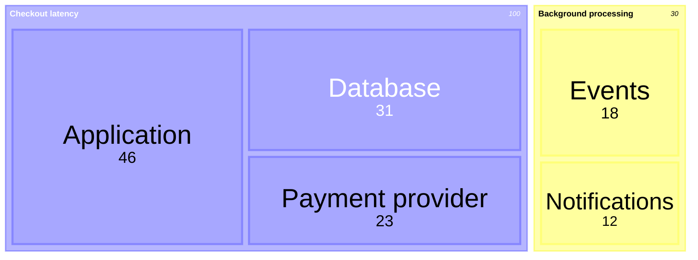

# Mermaid Treemap

Use `treemap-beta` for hierarchical proportions. Indentation defines hierarchy
and quoted leaves carry numeric values.

State units and nesting semantics. Preserve values in accessible text. Avoid
rectangle comparisons when exact values matter or the hierarchy is shallow
enough for a bar chart. This family is renderer-gated.

Source: [Mermaid treemap](https://mermaid.js.org/syntax/treemap.html).
