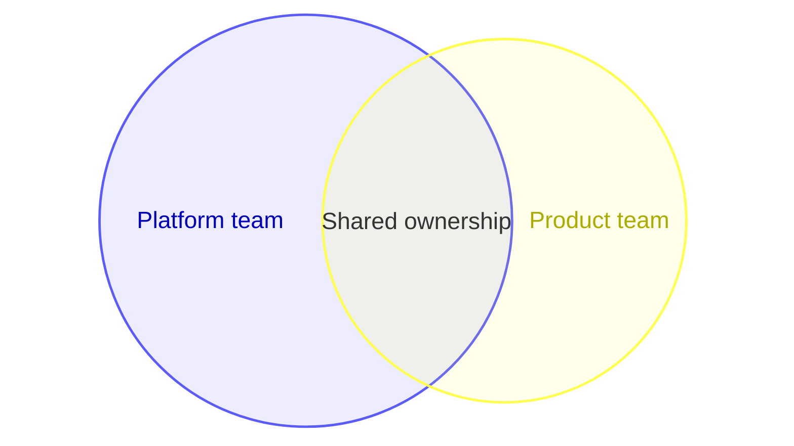

# Mermaid Venn Diagram

Use `venn-beta` for true set membership and overlap. Define sets before unions.
Compatible renderers support labels, sizes, text nodes, and styles.

Use exact set semantics, not loose similarity. More than three sets or many
intersections usually need a matrix or UpSet-style visualization. Preserve the
set values in accessible text. This family is renderer-sensitive.

Source: [Mermaid Venn diagram](https://mermaid.js.org/syntax/venn.html).
