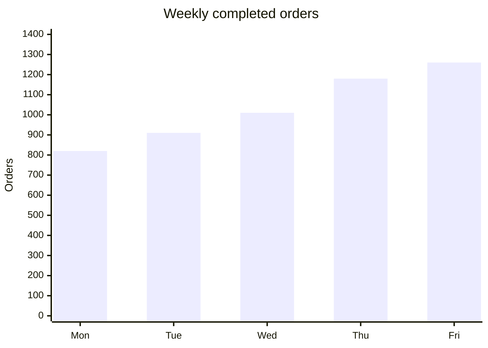

# Mermaid XY Chart

Use `xychart-beta` for compact bars or lines on categorical or numeric axes.
Declare a title, axes, optional ranges, and `bar` or `line` series.

Label units and time basis, start magnitude bars at zero, do not interpolate
missing periods, and provide values in text or a table. Use one series when the
renderer cannot label multiple series clearly.

Source: [Mermaid XY chart](https://mermaid.js.org/syntax/xyChart.html).
