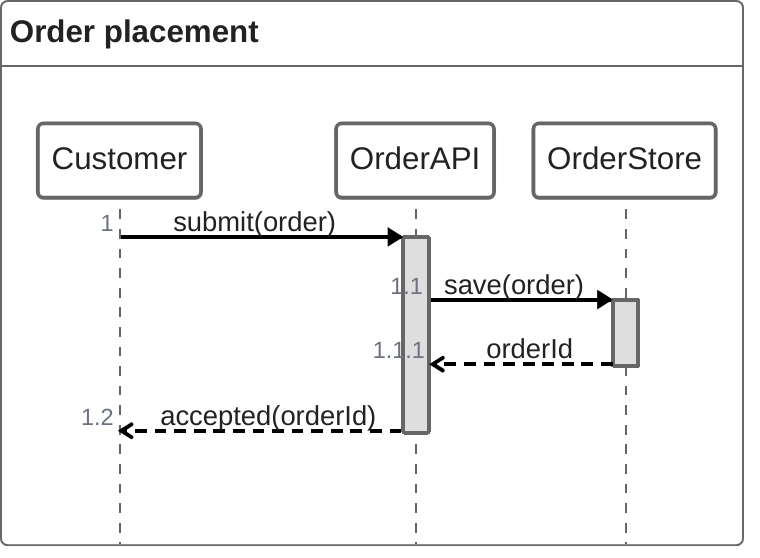

# Mermaid ZenUML

Use `zenuml` for compact code-like interactions only when the target bundles
ZenUML. It supports participants, synchronous and asynchronous messages,
replies, nesting, loops, alternatives, annotations, and comments.

Verify the host because ZenUML is an integrated external grammar. Keep
code-like calls understandable to the reader. Prefer a standard sequence
diagram for maximum portability.

Source: [Mermaid ZenUML](https://mermaid.js.org/syntax/zenuml.html).
